# Dogfood Report: Cypra

| Field       | Value                                                                                             |
| ----------- | ------------------------------------------------------------------------------------------------- |
| **Date**    | 2026-05-05                                                                                        |
| **App URL** | https://cypra.localhost                                                                           |
| **Session** | cypra                                                                                             |
| **Scope**   | Full frontend smoke test (Dashboard, all sidebar routes, Account, command palette, mobile, login) |

## Status (Phase 14.5 closeout)

The 20 issues below were the original audit. The first-pass plan landed in earlier commits. A subsequent code audit found ~30 additional silent buttons; Phase 14.5 in `TASKS.md` resolves them. As of Phase 14.5:

- **All install-level stub routes** (`/dashboard/users`, `/dashboard/projects`, `/dashboard/auth-methods`, `/dashboard/members`, `/dashboard/audit`, `/dashboard/settings`) now resolve to the SPA's 404 page per DESIGN.md §11. `SidebarNav` is scope-aware.
- **Every spec'd interactive control is wired**: AccountProfile (Add passkey, Regenerate backup codes, Sign out other sessions, Create PAT, last-passkey self-removal guard), TenantOverview (Invite user/member, Create project), TenantList & ProjectList (Create CTAs in headers and empty states), MembersTab (Resend invite, role SaveBar), AuditLogScreen (Refresh, Export NDJSON), InstanceAdminsScreen (pending-invite Revoke), SetupWizard (Retry), TenantSwitcher (Create tenant), all SaveBars across branding/email/upstream/members.
- **New backend endpoint:** `POST /api/v1/auth/sessions/revoke-others`. Test: `TestAuthRevokeOtherSessionsKeepsCallerSession`.
- **New module:** `dashboard/src/modals.tsx` houses `CreateTenantModal`, `CreateProjectModal`, `InviteUserModal`, `CreatePATModal`, `RegenerateBackupCodesModal`, `AddPasskeyModal`.
- **Regression gate:** `make lint-no-ops` is part of `lint:` → `ci-pipeline`.

**Local verification (green at time of writing):**

- `bun run typecheck` — green
- `bun run test` — 33/33
- `make lint-no-ops` — exits 0
- `go build ./...` — green

The agent-browser end-to-end re-run is pending. The dev server `cypra serve` process is older than the latest backend changes, so it needs to be restarted to pick up the new revoke-others route. Recommended close-out:

1. Restart `make dev` so the new `cypra serve` binary embeds the updated routes.
2. Re-run the agent-browser scenarios from each of the original 20 issues. Expect ISSUE-001/002/008/009/010/011/013/019 to be cleanly resolved and the silent-button audit (Account, Tenant Overview, Project List, Members, Instance Admins, Audit, Setup Wizard) to drop to 0.
3. Replace `dogfood-output/screenshots/` with the new walk; update the Summary table below to reflect remaining residue (expected: 0–1, where ISSUE-005 was already "could not reproduce" / harness-specific).

## Summary

| Severity  | Count  |
| --------- | ------ |
| Critical  | 2      |
| High      | 8      |
| Medium    | 6      |
| Low       | 4      |
| **Total** | **20** |

---

## Issues

### ISSUE-001: `/login` returns raw JSON instead of an HTML error/login page

| Field           | Value                         |
| --------------- | ----------------------------- |
| **Severity**    | critical                      |
| **Category**    | functional                    |
| **URL**         | https://cypra.localhost/login |
| **Repro Video** | N/A                           |

**Description**

Visiting `/login` in the browser renders a raw JSON body (`{"error":"tenant.not_found"}`) with no HTML wrapper, no styles, and no SPA shell. The `/login` route is being routed to a backend API handler instead of the SPA's 404 / login page.

`/signin` (a similar plausible URL) does properly hit the SPA and shows the styled "We couldn't find that page." 404.

If a logged-out user, a stale browser tab, or a marketing link points anyone at `/login`, they will see machine-readable JSON instead of a usable page.

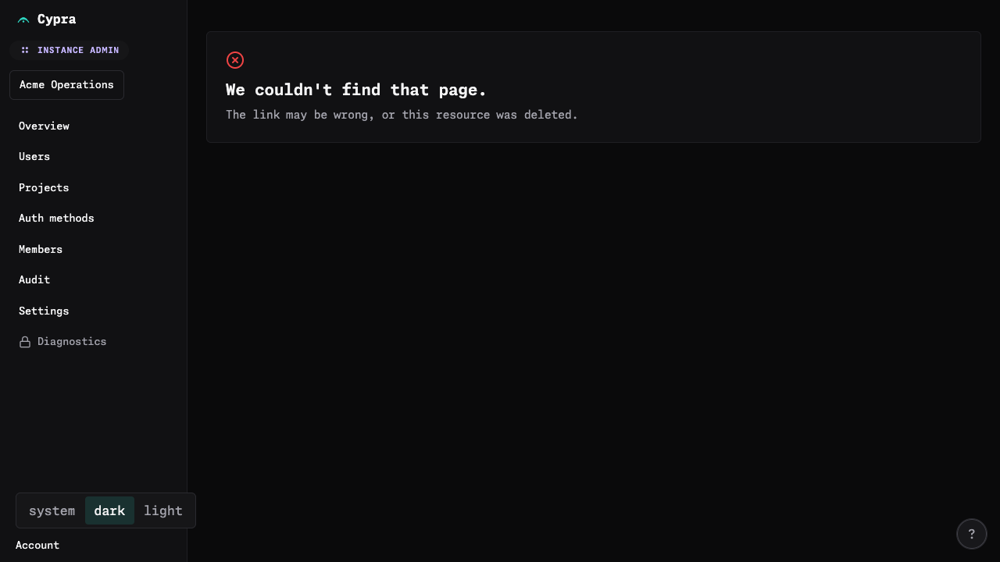
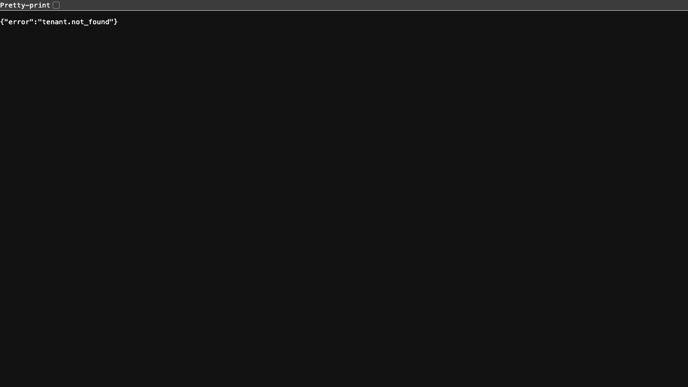

---

### ISSUE-002: No way to sign out of the app

| Field           | Value        |
| --------------- | ------------ |
| **Severity**    | critical     |
| **Category**    | functional   |
| **URL**         | (entire app) |
| **Repro Video** | N/A          |

**Description**

There is no "Sign out" / "Log out" affordance anywhere in the UI. The only related control is "Sign out **other** sessions" on the Account page, which only nukes other sessions, not the current one. The sidebar "Account" link goes to `/dashboard/account`, which has no logout button. Searching every visible button/link for `sign|logout|out` returns only "Sign out other sessions".

This is a security and basic-UX critical gap.

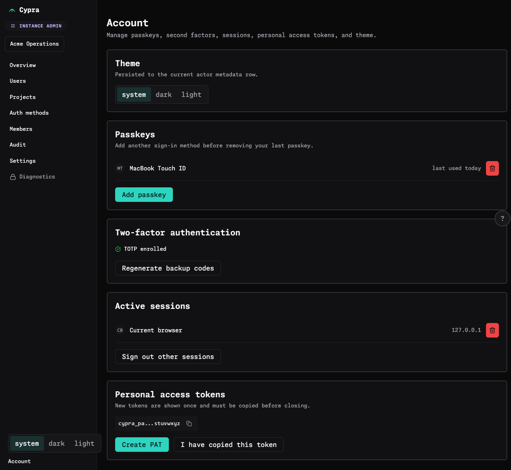

---

### ISSUE-003: "Signing key health" card content overflows its column on the dashboard

| Field           | Value                             |
| --------------- | --------------------------------- |
| **Severity**    | high                              |
| **Category**    | visual                            |
| **URL**         | https://cypra.localhost/dashboard |
| **Repro Video** | N/A                               |

**Description**

On the Dashboard at viewport widths around 1280–1366px, the "Signing key health" card's content (the green/orange/grey progress bar and the "Next rotation in 28 days" caption) is wider than the card. Measured: card `clientWidth=230`, `scrollWidth=285` (~55px overflow). The bar extends from x=1029.75 to x=1294.42, while the card ends at x=1241 — the bar exits the card and even the viewport (1280).

As a result, the bar visibly clips at the card's right edge, and "Next rotation in 28 days" wraps onto 4 awkward lines next to the kid pill.

The mobile layout renders the same content correctly — this is purely a desktop column-width / `min-width: 0` / `overflow` problem on the metrics row.

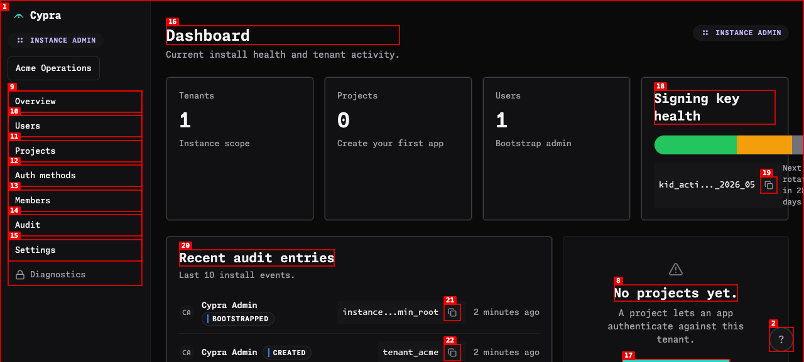
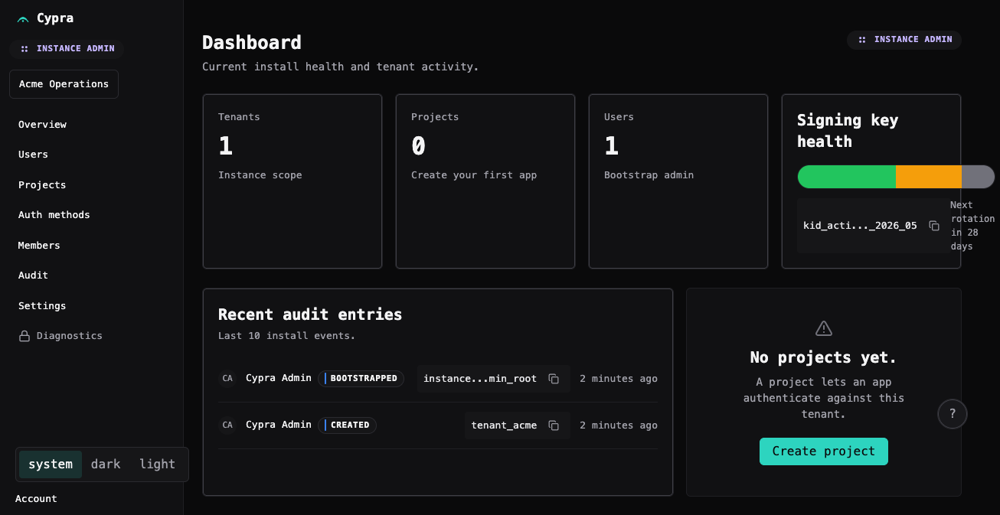

---

### ISSUE-004: Workspace switcher popover overflows off-screen to the LEFT and gets clipped

| Field           | Value                             |
| --------------- | --------------------------------- |
| **Severity**    | high                              |
| **Category**    | visual / functional               |
| **URL**         | https://cypra.localhost/dashboard |
| **Repro Video** | N/A                               |

**Description**

Clicking the "Acme Operations" disclosure (workspace switcher) in the sidebar opens a popover. The popover anchors so far left that its first ~30px is rendered off-screen. Visible labels read as "h tenants", "cme Operations", "reate tenant" (i.e. the leading characters of "Search tenants", "Acme Operations", "Create tenant" are clipped).

Dismissing it is also flaky: clicking the page background does not reliably close it, and clicking the "Account" link in the same sidebar while the popover is open produced an unexpected navigation to `about:blank` on one attempt (see ISSUE-005).

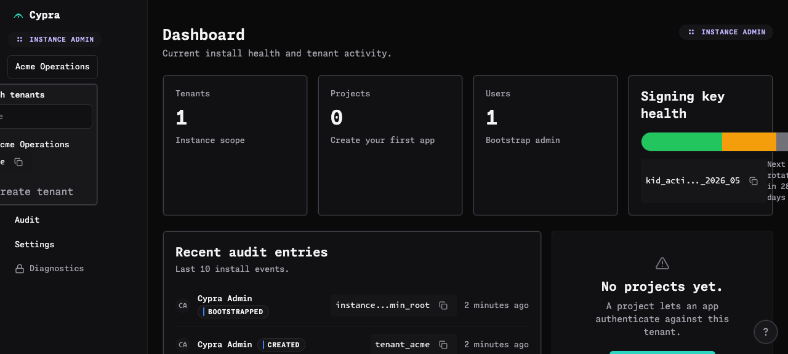

---

### ISSUE-005: Page navigates to `about:blank` after clicking sidebar "Account" link

| Field           | Value                                           |
| --------------- | ----------------------------------------------- |
| **Severity**    | high                                            |
| **Category**    | functional                                      |
| **URL**         | https://cypra.localhost/dashboard → about:blank |
| **Repro Video** | N/A                                             |

**Description**

After opening the workspace switcher popover and then clicking the sidebar "Account" link (which has `href="/dashboard/account"`), the browser ended up at `about:blank` with a fully blank page. URL after click was reported as `about:blank`. Going to `/dashboard/account` directly works fine.

This is reproducible after interacting with the workspace popover — the popover's outside-click / dismissal interaction appears to interfere with the link navigation (or vice versa) and yields an empty document.

---

### ISSUE-006: Account link is clipped below the fold and unreachable on a normal viewport

| Field           | Value                             |
| --------------- | --------------------------------- |
| **Severity**    | high                              |
| **Category**    | ux / visual                       |
| **URL**         | https://cypra.localhost/dashboard |
| **Repro Video** | N/A                               |

**Description**

On a 1280×720 viewport, the sidebar's "Account" link sits at top=641.5, bottom=661 — `viewportClipped=true`. The sidebar's outer `
` has `overflow: visible` and no internal scroll, so when the sidebar content exceeds viewport height, "Account" simply falls off the bottom and there's no scrollbar to reach it. On any user whose effective viewport height is ≤640px (Chromebooks, ultrawide-secondary monitors, browser with multiple toolbars/extensions, split-screen on a laptop), Account becomes unreachable from the sidebar.

 — note "Account" only just visible at the bottom.

---

### ISSUE-007: Account link is missing entirely from the mobile navigation drawer

| Field           | Value                                      |
| --------------- | ------------------------------------------ |
| **Severity**    | high                                       |
| **Category**    | ux / functional                            |
| **URL**         | https://cypra.localhost/dashboard (≤375px) |
| **Repro Video** | N/A                                        |

**Description**

On mobile (375×800), the desktop `<aside>` is hidden via `display: none`, but the Account link lives **inside** that hidden aside — it is not rendered into the mobile drawer. The mobile drawer contains: workspace, Overview, Users, Projects, Auth methods, Members, Audit, Settings, Diagnostics, theme switcher — and nothing else. There is no Account entry, so mobile users cannot reach `/dashboard/account` without typing the URL.

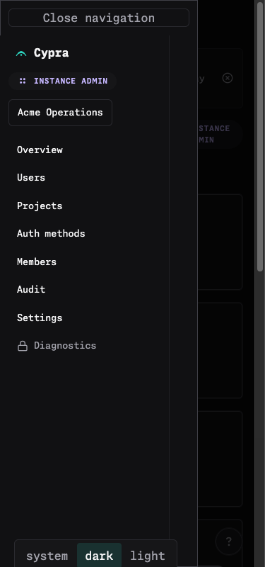

---

### ISSUE-008: Five separate routes show developer placeholder text instead of real content

| Field           | Value                                                                                                                     |
| --------------- | ------------------------------------------------------------------------------------------------------------------------- |
| **Severity**    | high                                                                                                                      |
| **Category**    | content                                                                                                                   |
| **URL**         | /dashboard/users, /dashboard/projects, /dashboard/auth-methods, /dashboard/members, /dashboard/audit, /dashboard/settings |
| **Repro Video** | N/A                                                                                                                       |

**Description**

Every sidebar route except Overview and Account renders the same templated stub:

> "This route is wired. The full data surface lands in a later phase."
> "No {users|projects|auth methods|members|audit|settings} yet."
> "The route is ready for data-backed implementation."
> [Create button]

This is internal phase / dev language that should not be visible to users. Six top-level pages are effectively non-functional placeholders.

The Account page also has the dev-flavoured line "Persisted to the current actor metadata row." under Theme — same problem, lower visibility.

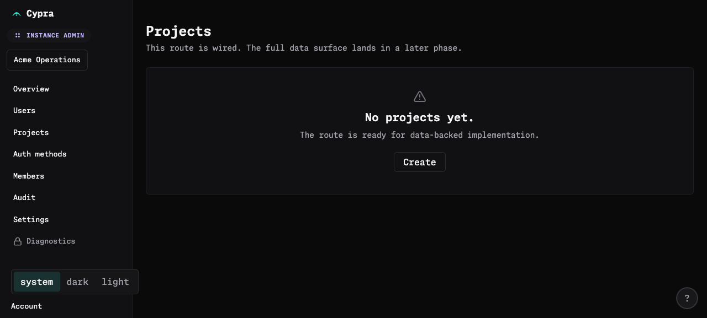
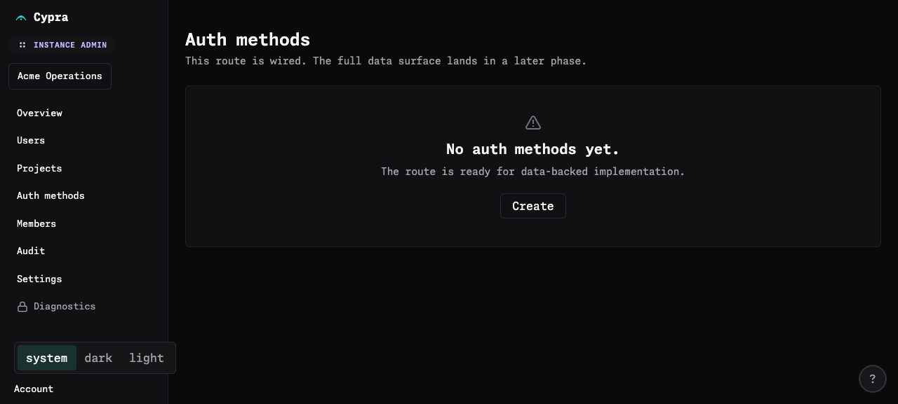
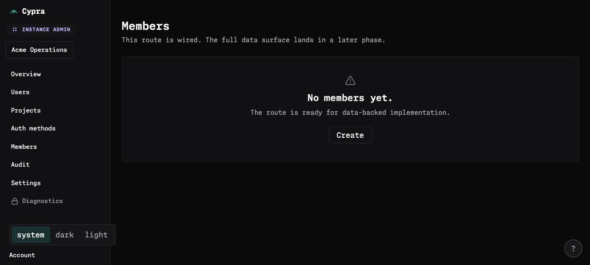
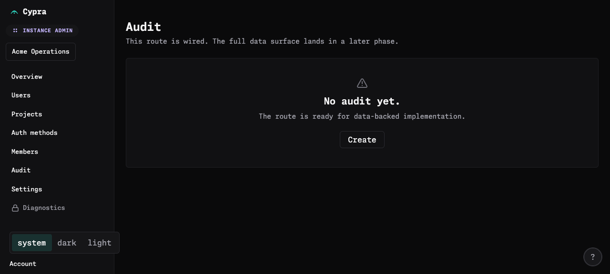
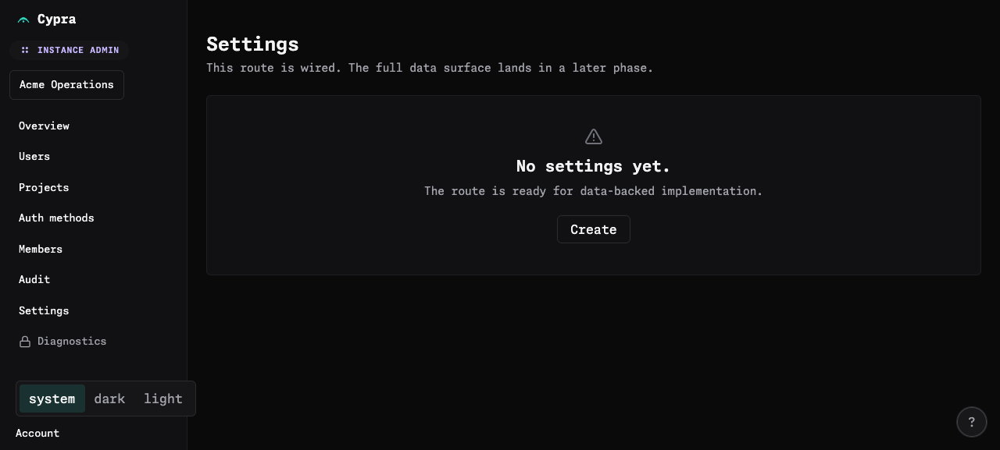

---

### ISSUE-009: Empty-state "Create" buttons on stub routes do nothing when clicked

| Field           | Value                                                                                                                                                                  |
| --------------- | ---------------------------------------------------------------------------------------------------------------------------------------------------------------------- |
| **Severity**    | high                                                                                                                                                                   |
| **Category**    | functional                                                                                                                                                             |
| **URL**         | /dashboard/users, /dashboard/projects, /dashboard/auth-methods, /dashboard/members, /dashboard/audit, /dashboard/settings, plus the "Create project" CTA on /dashboard |
| **Repro Video** | N/A                                                                                                                                                                    |

**Description**

Clicking the "Create" button on the Users / Projects / Auth methods / Members / Audit / Settings empty states produces zero effect: no modal, no navigation, no toast, no console activity. Same behaviour for the prominent teal "Create project" CTA on the Dashboard's empty-state panel.

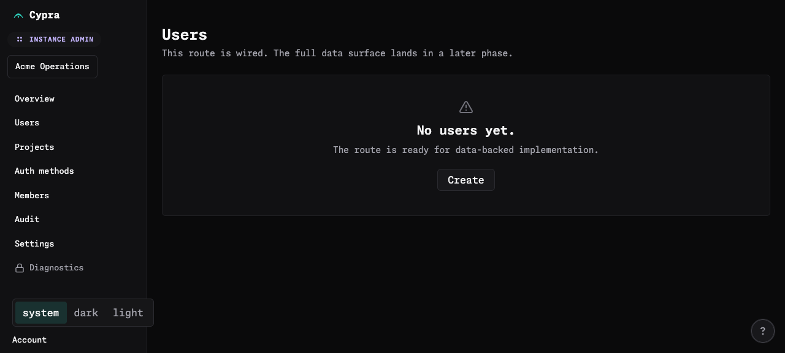

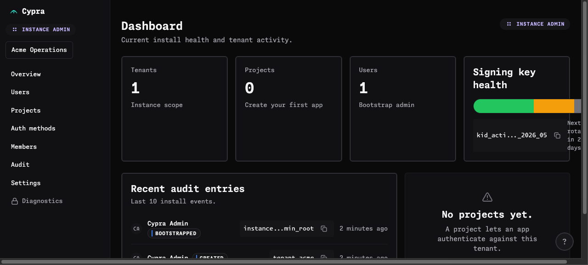

---

### ISSUE-010: "Create" CTAs on Audit and Settings pages are conceptually wrong

| Field           | Value                                 |
| --------------- | ------------------------------------- |
| **Severity**    | high                                  |
| **Category**    | ux / content                          |
| **URL**         | /dashboard/audit, /dashboard/settings |
| **Repro Video** | N/A                                   |

**Description**

The Audit empty state offers a "Create" button — audit entries are not user-created; they're emitted by the system. The dashboard already shows two existing audit entries, so the empty state is also factually wrong (data inconsistency between Dashboard and Audit page).

The Settings empty state likewise says "No settings yet." with a "Create" button. You don't "create settings". This appears to be the same generic stub copy applied indiscriminately to every route.

---

### ISSUE-011: Command palette exposes "Phase 9" placeholder and only ships two destinations

| Field           | Value                                            |
| --------------- | ------------------------------------------------ |
| **Severity**    | high                                             |
| **Category**    | content / functional                             |
| **URL**         | https://cypra.localhost/dashboard (cmd/ctrl + k) |
| **Repro Video** | N/A                                              |

**Description**

Opening the command palette (⌘K) shows the line "Placeholder content lands in Phase 9." directly under the heading — internal sprint language exposed to users. Furthermore, the palette only lists two actions: "Go to overview" and "Go to tenants". There is no `tenants` page in the navigation (the sidebar has Overview/Users/Projects/Auth methods/Members/Audit/Settings/Diagnostics/Account), so the one non-overview item points at a nonexistent surface and 8+ valid destinations are missing.

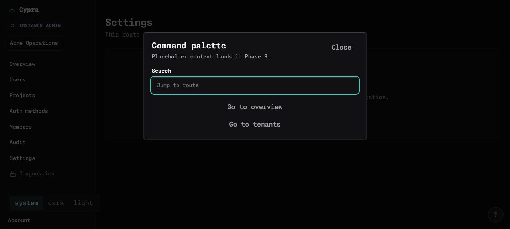

---

### ISSUE-012: Dashboard data is inconsistent across surfaces

| Field           | Value                                                      |
| --------------- | ---------------------------------------------------------- |
| **Severity**    | medium                                                     |
| **Category**    | functional / content                                       |
| **URL**         | https://cypra.localhost/dashboard vs /dashboard/users etc. |
| **Repro Video** | N/A                                                        |

**Description**

The Dashboard reports "Tenants 1", "Users 1", "Projects 0", "Recent audit entries: 2 events". But every detail page that should back those numbers ("Users", "Projects", "Audit") shows "No X yet." This is a clear signal that those routes aren't pulling the same data the Dashboard tiles are. Either the dashboard tiles are mocked, the routes haven't been wired yet (likely, given ISSUE-008), or there's a tenant-scoping mismatch.

Either way, the user experience is "the dashboard says I have things, the pages say I don't."

---

### ISSUE-013: Duplicate "INSTANCE ADMIN" badge — one in sidebar header, one beside page title

| Field           | Value                             |
| --------------- | --------------------------------- |
| **Severity**    | medium                            |
| **Category**    | visual / ux                       |
| **URL**         | https://cypra.localhost/dashboard |
| **Repro Video** | N/A                               |

**Description**

The "INSTANCE ADMIN" pill renders twice on the Dashboard: once in the sidebar header (under "Cypra"), and again at the top-right of the main pane next to the "Dashboard" h1. They communicate the exact same thing in the exact same visual style.

---

### ISSUE-014: Sidebar/account theme buttons have no `aria-pressed` and no immediate visual feedback

| Field           | Value              |
| --------------- | ------------------ |
| **Severity**    | medium             |
| **Category**    | accessibility / ux |
| **URL**         | every page         |
| **Repro Video** | N/A                |

**Description**

The `system / dark / light` segmented control (rendered both in the sidebar and on the Account page) has `aria-pressed={null}` on every button, so screen readers can't tell which is active. Visually one button has a darker background, but there's no programmatic state, no `role="radiogroup"` wrapper, and no `aria-pressed` swap.

Clicking from the sidebar also has a perceptible delay (~1s) before the body styles update; during that window the button gives no "I heard you" affordance.

---

### ISSUE-015: Copy buttons (Key ID, Resource ID, PAT) give no UI feedback after click

| Field           | Value                                                 |
| --------------- | ----------------------------------------------------- |
| **Severity**    | medium                                                |
| **Category**    | ux                                                    |
| **URL**         | https://cypra.localhost/dashboard, /dashboard/account |
| **Repro Video** | N/A                                                   |

**Description**

The "Copy Key ID" button on the signing-key card, the two "Copy Resource ID" buttons on the audit list, and the "Copy Personal access token" button on Account fire on click but show no toast, no checkmark, no temporary "Copied!" state. Users can't tell whether the copy succeeded. Standard pattern is at minimum a 1.5s confirmation state on the button itself.

---

### ISSUE-016: axe-core accessibility violations on every page (warnings in console)

| Field           | Value                   |
| --------------- | ----------------------- |
| **Severity**    | medium                  |
| **Category**    | accessibility / console |
| **URL**         | every page              |
| **Repro Video** | N/A                     |

**Description**

Console consistently emits `[warning] axe violations [Object]` on each route. The app appears to run axe in dev — good — but the violations are not being acted on. (`window.__lastAxeViolations` was empty when probed, so the violation array isn't being persisted globally for inspection.) Confirmed contributors so far: missing `aria-pressed` on the segmented-control buttons (ISSUE-014), and the joined-string accessible name on the page shell (ISSUE-018). There are likely more — the warnings should be triaged.

---

### ISSUE-017: Light theme has poor contrast on the metric numerals on Dashboard

| Field           | Value                                           |
| --------------- | ----------------------------------------------- |
| **Severity**    | medium                                          |
| **Category**    | accessibility / visual                          |
| **URL**         | https://cypra.localhost/dashboard (light theme) |
| **Repro Video** | N/A                                             |

**Description**

In light theme, the headline numbers in the Tenants/Projects/Users tiles ("1", "0", "1") are extremely faint against the white card background — visibly lower contrast than the surrounding metadata text. They look almost watermark-like and likely fail WCAG AA. The secondary label rows ("Instance scope", "Bootstrap admin") read fine.

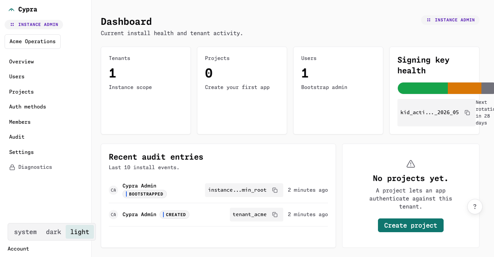

---

### ISSUE-018: Page shell has a giant joined-string accessible name

| Field           | Value                   |
| --------------- | ----------------------- |
| **Severity**    | low                     |
| **Category**    | accessibility / content |
| **URL**         | every page              |
| **Repro Video** | N/A                     |

**Description**

The root `
` carries an accessible name of `"OUPAMASMissing instance permissionsystemdarklightCypraInstance adminAcme OperationsSearch tenantsAcm…"` — i.e., the text content of all keyboard-shortcut hints (`O U P A M A S`), plus an "Missing instance permission" message that's never visually shown, plus theme buttons, plus workspace search has been concatenated into a single accessible name on the page-shell `
`. Screen readers will announce this nonsense string when focus enters the shell.

This usually means an `aria-label`/`aria-labelledby` is mistakenly applied to the outer container, or hidden helper elements lack `aria-hidden="true"`.

---

### ISSUE-019: Empty-state grammar — "No audit yet." / "No settings yet." read as broken English

| Field           | Value                                                        |
| --------------- | ------------------------------------------------------------ |
| **Severity**    | low                                                          |
| **Category**    | content                                                      |
| **URL**         | https://cypra.localhost/dashboard/audit, /dashboard/settings |
| **Repro Video** | N/A                                                          |

**Description**

"No audit yet." should read "No audit entries yet." or "No audit log yet." — "audit" as a bare noun without a head noun reads awkwardly. Same problem with "No settings yet." (you don't _count_ settings).

---

### ISSUE-020: Keyboard shortcuts overlay advertises only "g then o" while hinting at unimplemented `g u/p/a/m/a/s` sequences

| Field           | Value                             |
| --------------- | --------------------------------- |
| **Severity**    | low                               |
| **Category**    | functional / content              |
| **URL**         | https://cypra.localhost/dashboard |
| **Repro Video** | N/A                               |

**Description**

The keyboard shortcut overlay shows `g then o → Go to overview`, but the sidebar exposes 7+ navigable routes. The accessibility-tree text contains the suspicious sequence `OUPAMAS` (Overview, Users, Projects, Auth methods, Members, Audit, Settings) which strongly suggests `g u`, `g p`, `g a`, `g m`, `g a`, `g s` shortcuts were intended but not surfaced. Either land them, or remove "g then o" from the overlay until the rest exist (one shortcut to one of nine pages is barely useful).

Also: pressing `c` for "Primary create" while on Settings or Audit will (per ISSUE-009 / ISSUE-010) trigger a "Create" affordance that does nothing or is conceptually wrong.

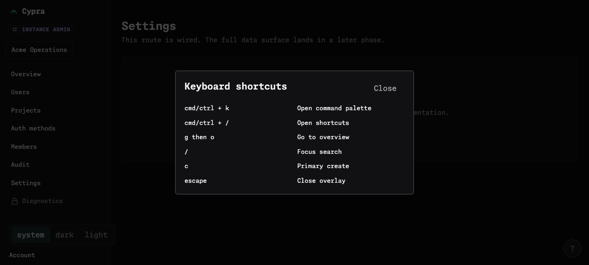

---
